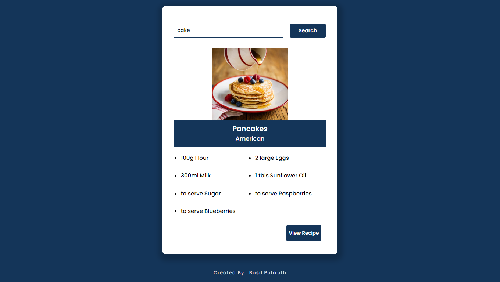

# Javascript Recipe App

Create a Recipe App using HTML, CSS and Javascript. We have used the MealDB API for this project.


## Preview




## 🛠 Skills
Javascript[ promise , fetch,... ], HTML, CSS, Git....


## Run Locally

Clone the project

```bash
  git clone https://link-to-project
```

Go to the project directory

```bash
  cd my-project
```

you can acess with changing commits


## Support

For support, email basilxg321@gmail.com


## Authors

- [@iambasilp](https://www.github.com/iambasilp)

